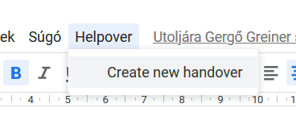
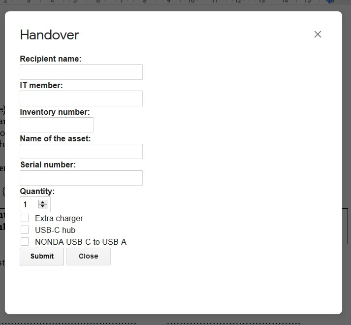
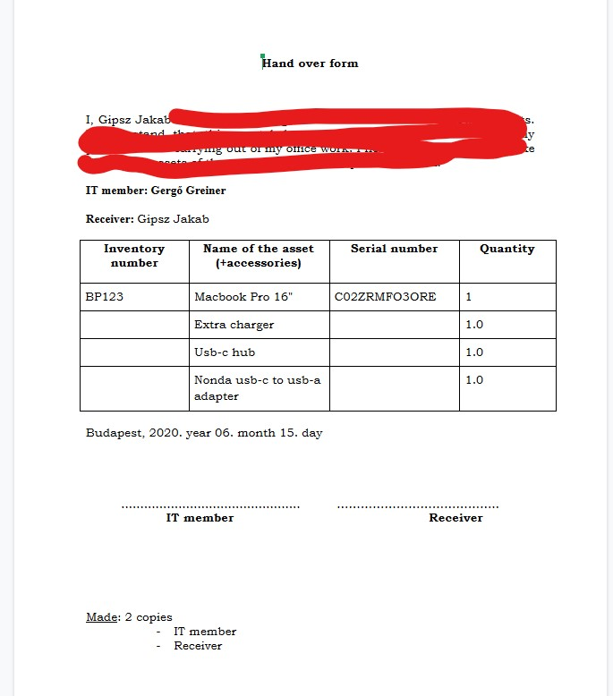

# Helpover
A simple Apps Script I did, for automating the handover-creation process at work.
## Why?
Doing a 2 page handover document by hand is a really boring and time-consuming work, especially when you need to do 4 or 5 in the morning. Also it seemed like a cool and useful project which saves time for the entire IT team.
## Usage
* First, you click on _"Create new handover"_ under the _"Helpover"_ menu.
* Then you fill out the form, and click submit. (You got autocomplete for the names. _**More time saved.**_)
* Congrats, your handover is ready, the time is automatically filled out for you, _and also,_ you got a copy of the document on your drive without the script.
* Unfortunately, you have to click "Redo" to create another one.  _**Less time saved.**_
## Pictures

